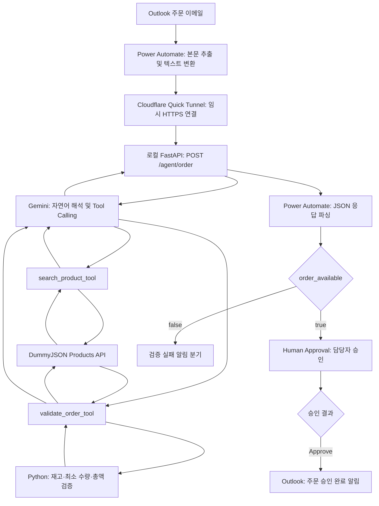
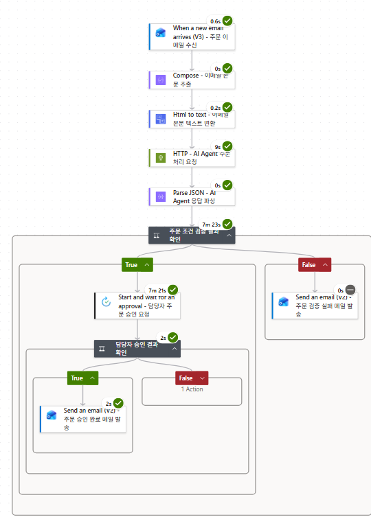
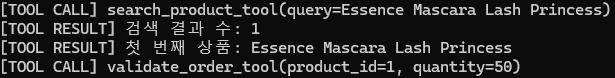
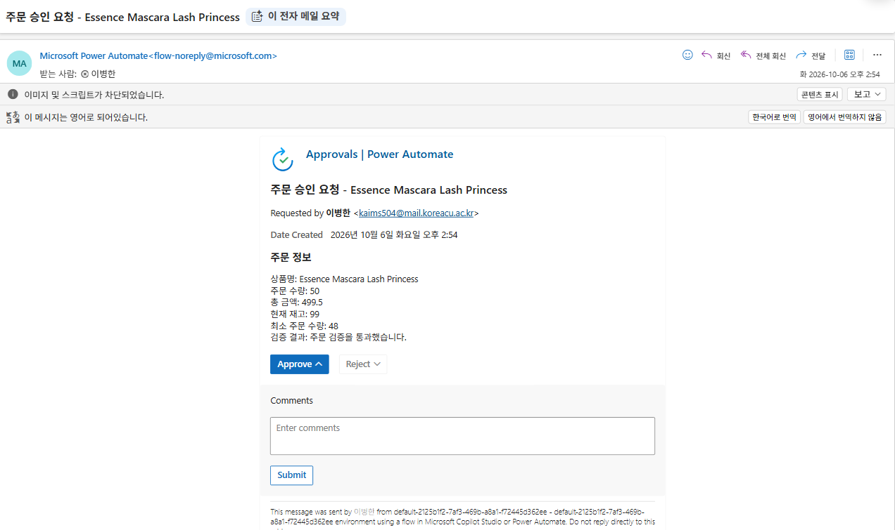
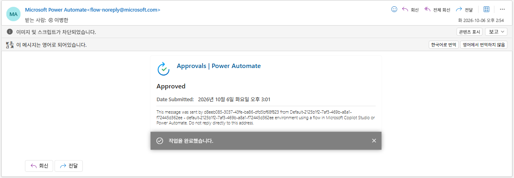
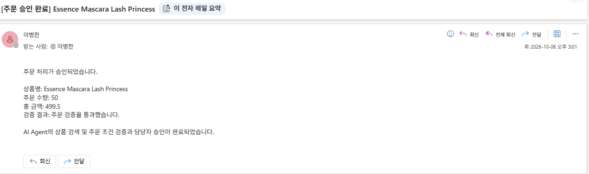

# AI Order Processing Agent

자연어 주문 이메일을 AI Agent가 해석하고, 외부 상품 API와 주문 검증 로직을 호출한 뒤 Power Automate의 Human Approval과 Outlook 알림까지 연결하는 주문 처리 자동화 프로젝트입니다.

Microsoft 365 기반 업무 프로세스를 Power Automate가 오케스트레이션하고, FastAPI가 외부 API 연계와 비즈니스 로직을 제공합니다. LLM은 자연어 해석과 도구 선택·호출을 담당하며, 주문 가능 여부를 직접 판단하지 않습니다. 재고 조건·최소 주문 수량(MOQ) 충족 여부·총액·주문 가능 여부는 Python 백엔드가 결정합니다.

이 프로젝트는 업무 연계 흐름을 검증한 PoC입니다. 실제 검증 범위는 **이메일 수신 → AI 상품 검색 및 주문 검증 → 담당자 Approve → 승인 완료 이메일 수신**입니다. ERP 주문 생성, 결제, 재고 차감은 구현 범위에 포함되지 않습니다.

## 핵심 기능

- 자연어 주문을 받으며 외부 API 연계와 비즈니스 로직을 제공하는 FastAPI `POST /agent/order` API
- Gemini Tool Calling을 통한 상품 검색 및 주문 조건 검증
- DummyJSON Products API의 상품·가격·재고·최소 주문 수량 조회
- 공통 Python 함수 `validate_order_rules`를 통한 결정적 비즈니스 규칙 처리
- Power Automate 오케스트레이션을 통한 구조화된 응답 기반 조건 분기와 Human-in-the-loop 승인
- Outlook을 통한 승인 요청 및 승인 완료 알림

## Architecture



Cloudflare Quick Tunnel은 Power Automate가 로컬 FastAPI를 호출하도록 연결한 **PoC용 임시 HTTPS 터널**입니다. 운영 배포나 상시 서비스 환경을 의미하지 않습니다. API 응답은 같은 HTTP 요청의 응답으로 Power Automate에 전달됩니다.

## 처리 흐름

1. Outlook으로 주문 이메일을 수신합니다.
2. Power Automate가 본문을 추출하고 HTML을 텍스트로 변환합니다.
3. HTTP 액션에서 `/agent/order`에 `message`를 전달합니다.
4. Gemini가 `search_product_tool`로 상품을 검색합니다. 현재 도구는 첫 번째 검색 상품만 반환합니다.
5. Gemini가 상품 ID와 수량으로 `validate_order_tool`을 호출합니다.
6. 백엔드는 상품을 다시 조회하고 `quantity <= stock`, `quantity >= minimumOrderQuantity`를 검증합니다. 두 조건이 참이면 `order_available=true`이며 총액은 `price * quantity`입니다.
7. Power Automate가 응답의 `order` 객체를 파싱하고 주문 가능 여부를 확인합니다.
8. 주문 가능 시 담당자에게 승인을 요청하고, Approve 결과에 따라 승인 완료 메일을 발송합니다.

성공 경로는 E2E로 검증했습니다. 실행 화면에 검증 실패·승인 비승인 분기가 보이지만, 해당 경로의 E2E 성공 여부는 확보한 증거만으로 주장하지 않습니다.

## 기술 스택

| 구성 | 역할 |
|---|---|
| Python / FastAPI / Pydantic | HTTP API, 요청 모델, 주문 규칙 검증 |
| Google Gen AI SDK / Gemini | 자연어 해석과 Python 도구 호출 |
| HTTPX / DummyJSON Products API | 외부 시스템 API 연계 패턴을 검증하기 위한 공개 상품 API 조회 |
| python-dotenv | 로컬 환경변수 로드 |
| Uvicorn | 로컬 API 서버 실행 |
| Power Automate / Approvals | 메일 연계, 응답 파싱, 조건 분기, 담당자 승인 |
| Outlook | 주문 수신 및 결과 알림 |
| Cloudflare Quick Tunnel | 로컬 API에 대한 임시 HTTPS 접근 |

라이브러리 버전은 `requirements.txt`에 고정되어 있습니다. 코드에 설정된 모델 식별자는 `gemini-3.6-flash`이며, 실행 계정에서의 모델 접근 권한과 API 사용 가능 여부가 필요합니다.

## 프로젝트 구조

```text
.
├── backend/app/main.py
├── docs/
│   ├── examples/
│   │   ├── agent-order-success.json
│   │   └── agent-order-success.txt
│   └── screenshots/
│       ├── README.md
│       ├── power-automate-success.png
│       ├── tool-calling-log.png
│       ├── approval-request.png
│       ├── approval-result.png
│       ├── order-approved-email.png
│       └── run-history-success.png
├── .env.example
├── .gitignore
├── requirements.txt
└── README.md
```

Power Automate의 가져오기 가능한 Flow 내보내기 파일은 포함되어 있지 않습니다. 전체 흐름을 재현하려면 본인의 환경에서 메일 연결, HTTP 호출, 응답 파싱, 승인 및 알림 액션을 구성해야 합니다.

## 실행 방법

### 1. Python 환경 준비

Python과 Windows PowerShell을 기준으로 합니다. 저장소를 내려받은 후 저장소 루트에서 실행합니다.

```powershell
git clone https://github.com/Willo54/ai-order-processing-agent.git
cd ai-order-processing-agent
py -m venv .venv
.\.venv\Scripts\python.exe -m pip install -r requirements.txt
Copy-Item .env.example .env
```

이미 `.env`가 있다면 복사 명령을 생략하세요. `.env`의 `GEMINI_API_KEY=your_api_key_here`를 본인의 키로 교체합니다. 실제 키는 저장소에 올리지 않습니다. `.env`, `.env.*`는 제외하고 `.env.example`만 추적하도록 설정되어 있습니다.

### 2. 로컬 서버 실행

```powershell
.\.venv\Scripts\python.exe -m uvicorn backend.app.main:app --reload --host 127.0.0.1 --port 8000
```

브라우저에서 `http://127.0.0.1:8000/docs`를 열면 API를 확인할 수 있습니다. 루트 `/`는 API 이름을 반환하며 외부 서비스 연결 상태까지 확인하는 헬스 체크는 아닙니다.

### 3. Power Automate 연결

`cloudflared`가 설치된 환경에서 별도 터미널로 실행합니다.

```powershell
cloudflared tunnel --url http://localhost:8000
```

출력된 임시 HTTPS 주소에 `/agent/order`를 붙여 Power Automate HTTP 액션의 URI로 설정합니다. Method는 `POST`, `Content-Type`은 `application/json`이며, Body의 `message`에는 텍스트로 변환한 이메일 본문을 연결합니다. 재시작으로 터널 주소가 달라지면 HTTP 액션 URI도 갱신해야 합니다.

응답의 `order.order_available`이 참인 경우 승인을 요청하고 Approve 결과에 승인 완료 메일을 연결합니다. Power Automate의 HTTP·승인·메일 액션을 사용할 수 있는 계정과 환경이 필요합니다. 현재 API에는 인증이 없으므로 테스트할 때만 터널을 열고 종료 후 닫으세요.

## API 예시

| Method | 경로 | 동작 |
|---|---|---|
| GET | `/` | API 이름 반환 |
| GET | `/product/{product_id}` | 상품 상세 조회 |
| GET | `/products/search?q=mascara` | 상품 목록 검색 |
| POST | `/orders/validate` | `product_id`, `quantity` 기반 규칙 검증 |
| POST | `/agent/order` | 자연어 주문 해석 및 도구 호출 |

PowerShell에서 자연어 주문 요청:

```powershell
$body = @{ message = '마스카라 50개 주문하고 싶어요.' } | ConvertTo-Json
Invoke-RestMethod -Method Post `
  -Uri 'http://127.0.0.1:8000/agent/order' `
  -ContentType 'application/json; charset=utf-8' `
  -Body ([System.Text.Encoding]::UTF8.GetBytes($body))
```

확보한 성공 응답의 `order` 부분:

```json
{
  "product_id": 1,
  "product_name": "Essence Mascara Lash Princess",
  "quantity": 50,
  "price": 9.99,
  "total_price": 499.5,
  "stock": 99,
  "minimum_order_quantity": 48,
  "stock_ok": true,
  "minimum_order_ok": true,
  "order_available": true,
  "message": "주문 검증을 통과했습니다."
}
```

[전체 성공 응답 JSON](docs/examples/agent-order-success.json)은 `received_message`, `agent_response`, `order`를 포함합니다. 상품 데이터와 자연어 답변은 재실행 시 달라질 수 있습니다. `order_available`은 주문 조건 통과 여부이며 담당자 승인 여부가 아닙니다.

현재 `/agent/order`는 도구 검증 결과가 없으면 422, Gemini 사용량 초과나 서버 오류에는 503, 그 외 Gemini 클라이언트 오류에는 502를 반환합니다. DummyJSON 통신 오류의 별도 응답 매핑은 아직 구현되지 않았습니다.

## Tool Calling

실행 시 확보한 로그입니다.

```text
[TOOL CALL] search_product_tool(query=Essence Mascara Lash Princess)
[TOOL RESULT] 검색 결과 수: 1
[TOOL RESULT] 첫 번째 상품: Essence Mascara Lash Princess
[TOOL CALL] validate_order_tool(product_id=1, quantity=50)
```

두 Python 함수를 SDK의 `tools`에 등록하고, 프롬프트에서 검색 후 검증 순서를 지시합니다. 해당 성공 실행에서 이 순서를 확인했습니다. 모든 요청에서 순서를 강제하는 별도의 상태 머신은 구현되어 있지 않습니다.

## Human-in-the-loop

백엔드의 조건 검증을 통과한 주문도 담당자의 승인을 거칩니다. Power Automate의 `Start and wait for an approval` 단계에서 상품명·수량·총액·재고·최소 주문 수량을 확인하고 승인합니다.

확보한 승인 결과 화면에서는 `Approved`, 최종 Outlook 메일에서는 상품명, 수량 50, 총액 499.5와 주문 승인 완료 메시지를 확인했습니다. 사람의 승인은 Power Automate에서 처리하며 FastAPI에는 승인 상태 저장이나 주문 생성 API가 없습니다.

## 실행 결과 스크린샷

실제 성공 실행에서 상품 ID 1, 단가 9.99, 재고 99, 최소 주문 수량 48을 조회했습니다. 50개 주문은 검증을 통과했고 총액 499.5를 반환했습니다. 이후 담당자의 Approve와 최종 메일 수신을 확인했습니다.

### Power Automate 성공 실행



### 실제 Tool Calling 로그



### Run History


담당자 승인 대기 시간을 포함한 성공 실행입니다.

### 담당자 승인 요청



주문 검증 결과를 담당자에게 전달하고 Approve 또는 Reject를 선택하도록 요청합니다.

### 담당자 승인 결과



담당자의 승인 완료 상태를 확인했습니다. 메일 하단의 Microsoft 공통 안내에 Copilot Studio가 언급되지만, 이 프로젝트의 승인 흐름은 Power Automate로 구현했습니다.

### Outlook 주문 승인 완료 메일



상품 검색·주문 조건 검증·담당자 승인 이후 최종 알림 수신까지 확인했습니다. 함께 확보한 [응답 원본 텍스트](docs/examples/agent-order-success.txt)도 제공합니다.

## 설계 의도

- **언어 해석과 규칙 검증의 분리:** LLM은 자연어 해석과 도구 선택을 담당합니다. 재고·MOQ 조건과 총액·주문 가능 여부는 Python의 결정적 비즈니스 규칙으로 처리합니다.
- **검증 함수 재사용:** 직접 검증 API와 AI 도구가 `validate_order_rules`를 공유합니다.
- **구조화된 결과 활용:** Power Automate는 자유 형식 답변 대신 `order` 객체를 사용해 후속 처리를 결정합니다.
- **사람의 최종 판단:** 자동 검증 이후에도 승인 단계를 유지합니다.
- **외부 시스템 API 연계:** DummyJSON은 외부 시스템 API 연계 패턴을 검증하기 위한 공개 상품 API이자 PoC 데이터 소스입니다. 실제 ERP나 실시간 상거래 재고 시스템은 아닙니다.

## Limitations / Future Improvements

- **요청별 상태 관리:** `latest_validation_result` 전역 상태를 사용하므로 동시 요청에서 결과가 섞일 수 있습니다. 요청별 상태 관리와 동시성 검증이 필요합니다.
- **복수 상품 후보 선택:** 검색 시 첫 번째 결과만 사용합니다. 복수 후보 확인 흐름과 도구 인자·수량 검증을 강화할 수 있습니다.
- **외부 서비스 장애 대응:** Gemini / DummyJSON 의존성을 고려해 Retry / Fallback / Observability와 실패 경로 테스트를 강화해야 합니다.
- **운영 API 배포:** Cloudflare Quick Tunnel은 PoC용 임시 연결입니다. 운영 환경에서는 인증된 고정 API 배포와 호출 제한이 필요합니다.
- **ERP 트랜잭션:** 주문 저장·재고 차감·중복 주문 방지·승인 이력 저장은 미구현입니다. 실제 연계 시 트랜잭션 처리와 `Decimal` 기반 금액 계산 등을 보강해야 합니다.

현재 구현은 Power Automate와 Outlook을 중심으로 구성했으며, Copilot Studio / AI Builder / SharePoint 연계는 실행 환경의 테넌트 제약으로 범위에서 제외했습니다.
